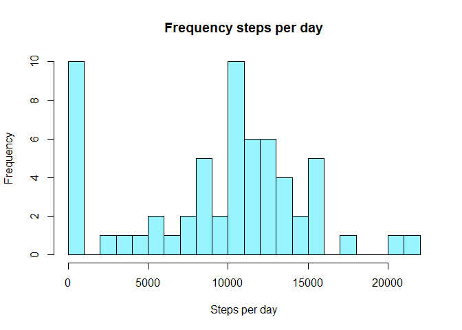
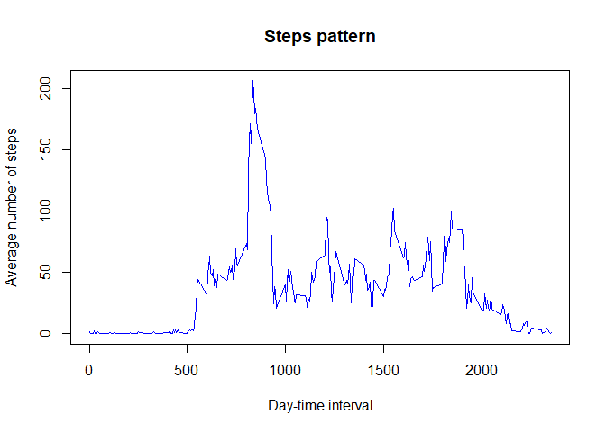
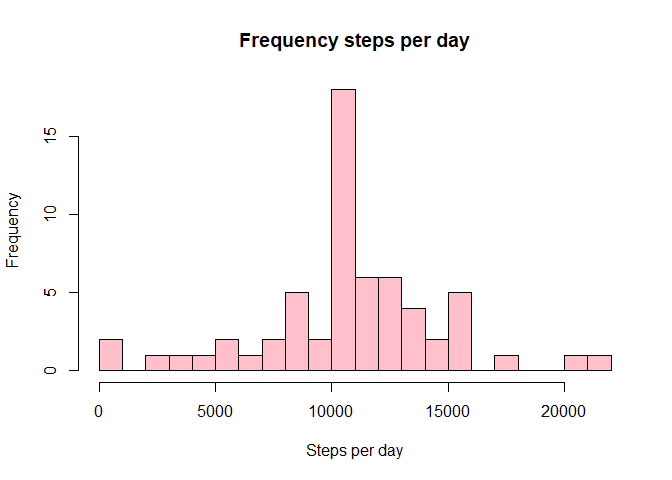
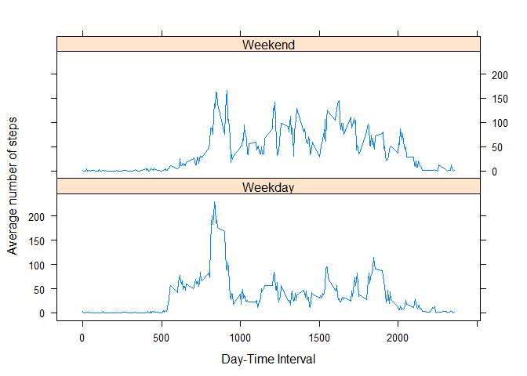

## Loading and preprocessing the data
The first step is to create a fork to our own Github account from
[Roger D. Peng's repo](https://github.com/rdpeng/RepData_PeerAssessment1).
Once we've done that, we can begin to process the data

The data is contained in a zip compressed file named activity. Unzipping this file will give us a csv file with
the data, which we will then read into a variable `data`into our environment.
We'll also call the `head()` function and the `str()` function to see how our data looks like


```r
unzip(".\\activity.zip", exdir = ".\\Data")
data <- read.csv(".\\Data\\activity.csv", header = TRUE, stringsAsFactors = FALSE)
head(data)
```

```
##   steps       date interval
## 1    NA 2012-10-01        0
## 2    NA 2012-10-01        5
## 3    NA 2012-10-01       10
## 4    NA 2012-10-01       15
## 5    NA 2012-10-01       20
## 6    NA 2012-10-01       25
```

```r
summary(data)
```

```
##      steps            date              interval     
##  Min.   :  0.00   Length:17568       Min.   :   0.0  
##  1st Qu.:  0.00   Class :character   1st Qu.: 588.8  
##  Median :  0.00   Mode  :character   Median :1177.5  
##  Mean   : 37.38                      Mean   :1177.5  
##  3rd Qu.: 12.00                      3rd Qu.:1766.2  
##  Max.   :806.00                      Max.   :2355.0  
##  NA's   :2304
```

```r
str(data)
```

```
## 'data.frame':	17568 obs. of  3 variables:
##  $ steps   : int  NA NA NA NA NA NA NA NA NA NA ...
##  $ date    : chr  "2012-10-01" "2012-10-01" "2012-10-01" "2012-10-01" ...
##  $ interval: int  0 5 10 15 20 25 30 35 40 45 ...
```

As we can see, our data consists of three variables. The first one, `steps`, consists of integers,
mainly, how many steps has the person given in the refered interval. Let's look at a summary of this variable:

```r
summary(data$steps)
```

```
##    Min. 1st Qu.  Median    Mean 3rd Qu.    Max.    NA's 
##    0.00    0.00    0.00   37.38   12.00  806.00    2304
```

The second and the third variables, `date` and `interval`, identify the moment for which the number of steps
was taken. This variables are of class character and integer, respectively. To make things easier in the future,
we'll redefine the class of `date` to set it to a Date class:


```r
data$date = as.Date(as.character(data$date))
class(data$date)
```

```
## [1] "Date"
```

## What is mean total number of steps taken per day?

To begin our analysis, we'll call the `dplyr` package first. Using this package, we can group the data bay date, and
then look at the summary statistics by day more easily. We'll call the group_by function to group by day, and then
calculate the summary statistics (mean, median and sum) by date. We'll store this data in a new table that we'll name
`sumStatistics


```r
library(dplyr)

sumStatistics <- data %>%
               group_by(date) %>%
               summarize(sum = sum(steps, na.rm = TRUE))
                         
head(sumStatistics)
```

```
## # A tibble: 6 x 2
##   date         sum
##   <date>     <int>
## 1 2012-10-01     0
## 2 2012-10-02   126
## 3 2012-10-03 11352
## 4 2012-10-04 12116
## 5 2012-10-05 13294
## 6 2012-10-06 15420
```

Using this table we just created, we can plot the histogram for the number of steps taken each day.


```r
hist(sumStatistics$sum, breaks = 20, main = "Frequency steps per day",
     xlab = "Steps per day", col = "cadetblue1")
```

<!-- -->

Now to calculate the mean and the median of steps:


```r
sumStatistics %>%
     summarize(mean = mean(sum, na.rm = TRUE), median = median(sum, na.rm = TRUE))
```

```
## # A tibble: 1 x 2
##    mean median
##   <dbl>  <int>
## 1 9354.  10395
```

## What is the average daily activity pattern?
Here, we want to see the daily pattern of the subject. This means, for each interval, on average how many steps were
taken. To do this, we have to group the `data` by interval and obtain the mean.


```r
byInterval <- data %>%
     group_by(interval) %>%
     summarize(mean = mean(steps, na.rm = TRUE))
head(byInterval)
```

```
## # A tibble: 6 x 2
##   interval   mean
##      <int>  <dbl>
## 1        0 1.72  
## 2        5 0.340 
## 3       10 0.132 
## 4       15 0.151 
## 5       20 0.0755
## 6       25 2.09
```

With this information, we can create the time series plot using a scatter plot, plotting the interval in the x-axis,
and the average number of steps taken on the y-axis, and setting `type = "l"`.


```r
with(byInterval, plot(interval, mean, type = "l", xlab = "Day-time interval", ylab = "Average number of steps",
                      main = "Steps pattern", col = "blue"))
```

<!-- -->

Now, to answer which interval has the maximum number of steps:


```r
data.frame(interval = byInterval[which.max(byInterval$mean), 1], max = max(byInterval$mean))
```

```
##   interval      max
## 1      835 206.1698
```

## Imputing missing values
First, to know how many missing values are there in the data


```r
sum(is.na(data$steps))
```

```
## [1] 2304
```

For the missing values, we'll just imput the mean for the interval. For this, we'll use the `expss` package.
We'll also create a new data set which we'll call `data2`.


```r
library(expss)
```

```
## Warning: package 'expss' was built under R version 3.5.3
```

```
## 
## Use 'expss_output_rnotebook()' to display tables inside R Notebooks.
##  To return to the console output, use 'expss_output_default()'.
```

```
## 
## Attaching package: 'expss'
```

```
## The following objects are masked from 'package:dplyr':
## 
##     between, compute, contains, first, last, na_if, recode, vars
```

```r
data2 <- data

for (i in 1:length(data2$steps)){
     if(is.na(data2$steps[i] == TRUE)){
          data2$steps[i] <- vlookup(data2$interval[i], byInterval)
     }
}

head(data2)
```

```
##       steps       date interval
## 1 1.7169811 2012-10-01        0
## 2 0.3396226 2012-10-01        5
## 3 0.1320755 2012-10-01       10
## 4 0.1509434 2012-10-01       15
## 5 0.0754717 2012-10-01       20
## 6 2.0943396 2012-10-01       25
```

```r
summary(data2)
```

```
##      steps             date               interval     
##  Min.   :  0.00   Min.   :2012-10-01   Min.   :   0.0  
##  1st Qu.:  0.00   1st Qu.:2012-10-16   1st Qu.: 588.8  
##  Median :  0.00   Median :2012-10-31   Median :1177.5  
##  Mean   : 37.38   Mean   :2012-10-31   Mean   :1177.5  
##  3rd Qu.: 27.00   3rd Qu.:2012-11-15   3rd Qu.:1766.2  
##  Max.   :806.00   Max.   :2012-11-30   Max.   :2355.0
```

Just to make sure there are no remaininig missing values.


```r
sum(is.na(data2$steps))
```

```
## [1] 0
```

Now, we make again a histogram with the new data set.

```r
sumStatistics2 <- data2 %>%
               group_by(date) %>%
               summarize(sum = sum(steps, na.rm = TRUE))

hist(sumStatistics2$sum, breaks = 20, main = "Frequency steps per day",
     xlab = "Steps per day", col = "pink")
```

<!-- -->

Getting the mean and the median


```r
sumStatistics2 %>%
     summarize(mean = mean(sum), median = median(sum))
```

```
## # A tibble: 1 x 2
##     mean median
##    <dbl>  <dbl>
## 1 10766. 10766.
```

Comparing with the previous data


```r
x <- data.frame(data_set = c("original data", "imputed na"), mean = c(0, 0), median = c(0, 0))
x[1, 2:3] <- sumStatistics %>% summarize(mean = mean(sum), median = median(sum))
x[2, 2:3] <- sumStatistics2 %>% summarize(mean = mean(sum), median = median(sum))
x
```

```
##        data_set     mean   median
## 1 original data  9354.23 10395.00
## 2    imputed na 10766.19 10766.19
```
As we can see, imputing missing data does have an impact on the mean and median.

## Are there differences in activity patterns between weekdays and weekends?
Let's work with the `data2`data set, i.e., with the data set with imputed data for missing values.

First, we'll create a new variable that describes whether it's a weekday or a weekend.


```r
Sys.setlocale("LC_TIME", "C") #so it's in english
```

```
## [1] "C"
```

```r
data2$day <- "weekday"
data2$date <- as.Date(data2$date)
for (i in 1:length(data2$date)){
     if(weekdays(data2$date[i]) == "Saturday" | weekdays(data2$date[i]) == "Sunday"){
          data2$day[i] = "weekend"
     }
}
data2$day <- as.factor(data2$day)
table(data2$day)
```

```
## 
## weekday weekend 
##   12960    4608
```

And now for the plot:


```r
byInterval2_weekday <- data2 %>%
     filter(day == "weekday") %>%
     group_by(interval) %>%
     summarize(mean = mean(steps, na.rm = TRUE))
byInterval2_weekday$day <- "Weekday"

byInterval2_weekend <- data2 %>%
     filter(day == "weekend")%>%
     group_by(interval) %>%
     summarize(mean = mean(steps, na.rm = TRUE))
byInterval2_weekend$day <- "Weekend"

byInterval2 <- rbind(byInterval2_weekday, byInterval2_weekend)
byInterval2$day <- as.factor(byInterval2$day)

library(lattice)
xyplot(mean ~ interval | day, data = byInterval2, layout = c(1, 2), type = "l", 
       xlab = "Day-Time Interval", ylab = "Average number of steps")
```

<!-- -->


